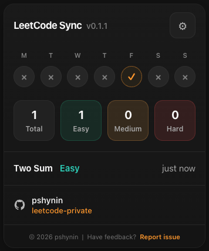
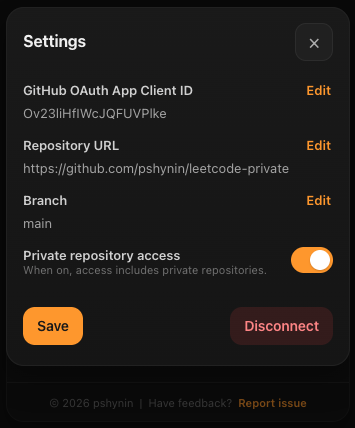
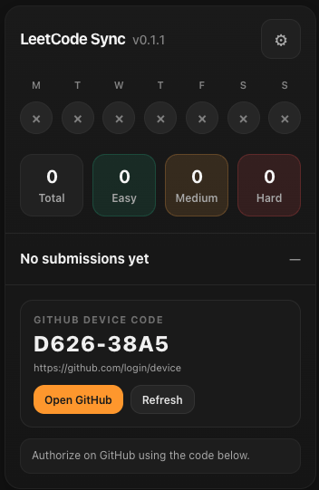

# LeetCode Sync

LeetCode Sync is a Chrome extension that automatically syncs accepted LeetCode submissions to a user-configured GitHub repository.

## Screenshot

## Why LeetCode Sync

Keeping LeetCode solutions in GitHub is useful for long-term tracking, backups, and personal archive, but doing it manually is repetitive and easy to forget.

LeetCode Sync automates that flow. Once configured, it detects accepted submissions, collects the required solution data, and writes the result to your GitHub repository.

## Features

- Automatic sync for accepted LeetCode submissions
- Support for public and private GitHub repositories
- GitHub Device Flow authentication (no PAT required)
- Configurable repository URL, branch, and private repository access
- Clean popup dashboard with recent sync activity and counters
- Built for a narrow single purpose with minimal required permissions

## How it works

1. Configure the extension with your GitHub OAuth App Client ID, repository URL, and branch.
2. Connect GitHub using the device authorization flow.
3. Submit a solution on LeetCode.
4. When the submission is accepted, the extension syncs the solution and a README summary to your GitHub repository.

## Requirements

Before setup, make sure you have:

- a GitHub account
- a GitHub repository
- a GitHub OAuth App with Device Flow enabled
- the extension installed in Chrome

## Setup

### 1. Create a GitHub OAuth App

In GitHub:

- go to `Settings`
- open `Developer settings`
- open `OAuth Apps`
- click `New OAuth App`

Recommended values:

- Application name: `LeetCode Sync`
- Homepage URL: `https://github.com/LeetCodeSync/leetcode-sync`
- Authorization callback URL: `https://github.com/LeetCodeSync/leetcode-sync`
- Enable Device Flow: `enabled`

After creating the app, copy the Client ID.

### 2. Configure the extension

Open the extension settings and enter:

- GitHub OAuth App Client ID
- Repository URL
- Branch
- Private repository access, if needed

Save the settings.

### 3. Connect GitHub

- open the extension popup
- click `Connect GitHub`
- click `Open GitHub`
- enter the device code shown by the extension
- approve access in GitHub
- return to the extension

After authorization, the extension is ready.

## Usage

- open a LeetCode problem
- submit your solution
- once the submission is accepted, the extension syncs it to GitHub
- the popup updates recent sync activity and counters

## Permissions

LeetCode Sync requests only the permissions required for its core functionality.

### Chrome permissions

- `storage` to save settings and session state
- `webRequest` to observe relevant submission-related request and response activity

### Host permissions

- `https://leetcode.com/*`
- `https://github.com/*`
- `https://api.github.com/*`

These are used only for:

- detecting accepted LeetCode submissions
- supporting GitHub device authorization
- creating commits and writing files to the configured repository

## Privacy

LeetCode Sync uses data only for its core functionality, including GitHub authentication, repository configuration, and syncing accepted LeetCode submissions.

It does not sell user data, use user data for advertising, or use user data for purposes unrelated to the extension’s single purpose.

See [PRIVACY.md](./PRIVACY.md) for details.

## Support

For bug reports and feature requests, use the GitHub issue forms:

- [Open support page](https://github.com/LeetCodeSync/leetcode-sync/issues/new/choose)

## Roadmap

Potential future improvements:

- richer commit metadata
- clearer sync history
- improved error visibility
- optional repository structure customization
- broader submission metadata support

## Development

This project is built as a Chrome Extension using Manifest V3.

Suggested areas to review in the codebase:

- background service worker
- popup UI
- content script and injected page bridge
- GitHub device authorization flow
- repository write logic
- local storage and settings

## Limitations

- GitHub authorization depends on valid OAuth App configuration
- sync behavior depends on LeetCode page structure remaining compatible
- repository access must be configured correctly
- only supported LeetCode flows and accepted submissions are synced

## License

This project is licensed under the MIT License. See [LICENSE](./LICENSE) for details.
